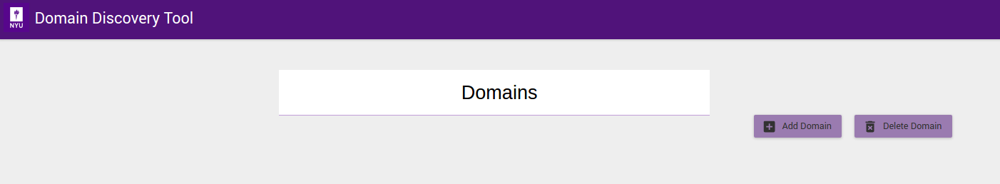
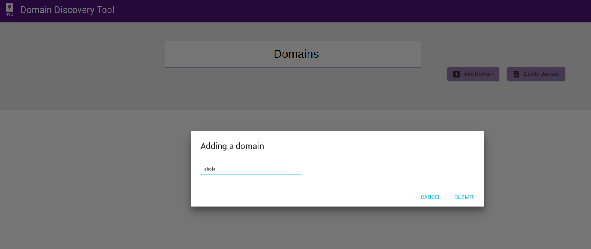
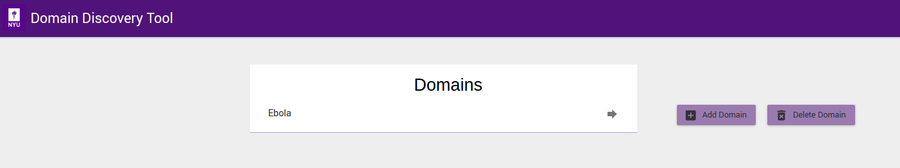

Create Domain
-------------

Begin by adding a domain on the Domains page (initial page), shown in the figure above, by clicking on the |add_domain| button. Domain maintains context of domain discovery. 

On the **Adding a domain** dialog shown in figure above, enter the name of the domain you would like to create, for example **Ebola**, and click on **Submit** button. You should now see the new domain you added in the list of domains as shown below.

Once domain is added click on domain name in the list of domains to collect, analyse and annotate web pages.
