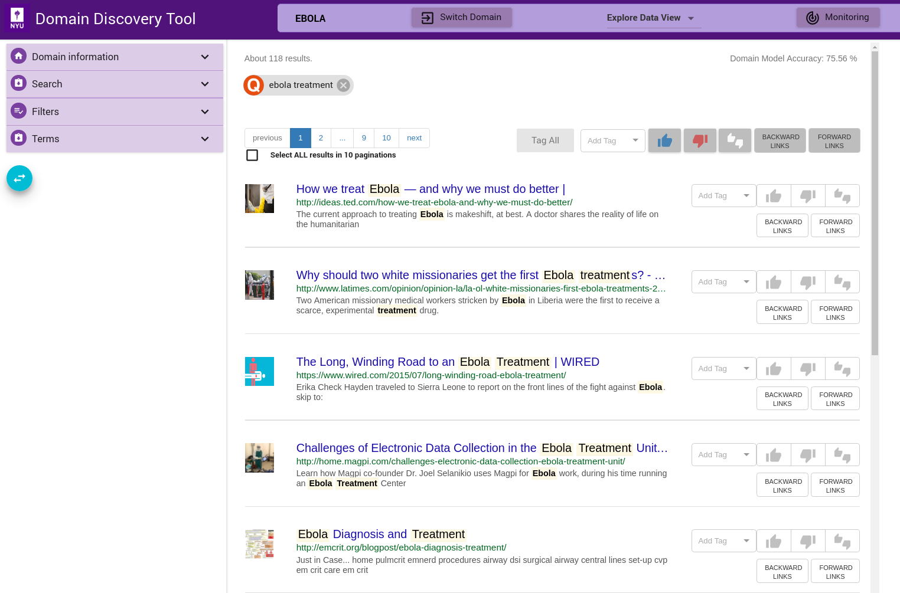

Annotate Pages
--------------

A model is created by annotating pages as **Relevant** or **Irrelevant** for the domain. Currently, the model can only distinguish between relevant and irrelevant pages. You can also annotate pages with custom tags. These can be later grouped as relevant or irrelevant when generating the model. Try to alternate between Steps 3a and 3b to build a model till you reach at least 100 pages for each. This will continuously build a model and you can see the accuracy of the model at the top right corner - **Domain Model Accuracy**.

Step 3a
*******

Tag at least 100 **Relevant** pages for your domain. Refer `How to Annotate`_.

Step 3b
*******

Tag at least 100 **Irrelevant** pages for your domain. Refer `How to Annotate`_.

How to Annotate
***************

In the **Explore Data View** you see the pages for the domain (based on any filters applied) as shown below:

The different mechanisms for annotating pages are:

Tag Individual Pages
<<<<<<<<<<<<<<<<<<<<

|tag_one|  buttons, along each page, can be used to tag individual pages.

Tag Selected Pages
<<<<<<<<<<<<<<<<<<

Select multiple pages by keeping the **ctrl** key pressed and clicking on the pages that you want to select. When done with selecting pages, release the **ctrl** key. This will bring up a window where you can tag the pages as shown below:

.. image:: figures/multi_select.png
   :width: 800px
   :align: center
   :height: 400px
   :alt: alternate text

Tag All Pages in View
<<<<<<<<<<<<<<<<<<<<<

.. |tag_all| image:: figures/tag_all.png

Use the |tag_all| buttons at the top of the list of pages to tag all pages in the current view

Tag All Pages for Current Filter
<<<<<<<<<<<<<<<<<<<<<<<<<<<<<<<<

If you want to tag all pages retrieved for a particular filter (across pagination), then check the **Select ALL results in <total pages> paginations** checkbox below the page list on top left. Then use |tag_all| buttons to tag all the pages.
		     
Custom Tag
<<<<<<<<<<

Custom tags can be added using Add Tag text box as shown below. Enter the custom tag in the Add Tag text box and press **enter** key. This adds the tag as a chip below the page info. This can be applied to individual, selected or all pages similar to relevant and irrelevant tags.

.. image:: figures/add_tag.png
   :width: 800px
   :align: center
   :height: 400px
   :alt: alternate text

Tag for Deep Crawl
<<<<<<<<<<<<<<<<<<

Some tags such as **Deep Crawl** are pre-configured. User can tag a page (or group of pages) for deep crawl by choosing the tag from the Add Tag drop-down as shown. For example, if user wants to deep crawl all the uploaded pages then they can tag the pages **Deep Crawl**.

.. image:: figures/deep_crawl_tag.png
   :width: 800px
   :align: center
   :height: 400px
   :alt: alternate text

      

