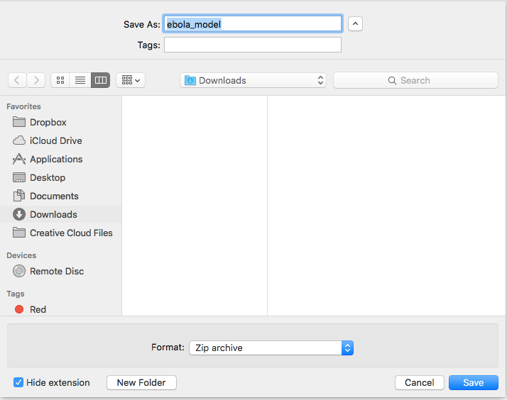
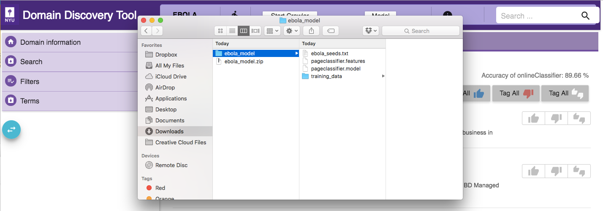
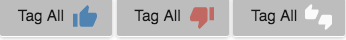

Create Model
------------

DDT incrementally builds a model as the user `annotates <http://domain-discovery-tool.readthedocs.io/en/latest/use.html#annotation>`_ the retrieved pages. The accuracy of the domain model is displayed on the top right corner. It provides an indication of the model coverage of the domain and how it is influenced by annotations.

The domain model can be exported by clicking on the **Model** button on the top (this button will be dsiabled when there are no sufficient annotations to build the model and the model **Accuracy of onlineClassifier: 0 %**). This will show a drop down as shown in figure below:

.. image:: model_dropdown.png
   :width: 800px
   :align: center
   :height: 400px
   :alt: alternate text

Click on **Create Model** to export the model. This should bring up a file explorer pop-up (makes sure you enable pop-up on your browser) as shown below. Save the compressed model file.

This saved model file contains the ACHE classifier model, the training data for the model and the initial seed list required for focused crawling as shown in figure below:

Annotation
~~~~~~~~~~

Currently, pages can be annotated as Relevant, Irrelevant or Neutral using the |tag_all| buttons respectively to tag all pages in the current view. |tag_one| buttons can be used to tag individual pages. Annotations are used to build the domain model. 

.. |tag_one| image:: tag_one.png

Note:

* At least 10 pages each of relevant and irrelevant pages should be annotated to build the model. The more the annotations, hence the better coverage of the domain, the better the domain model.
* Ensure that the relevant and irrelevant page annotations are balanced for a better model.  

