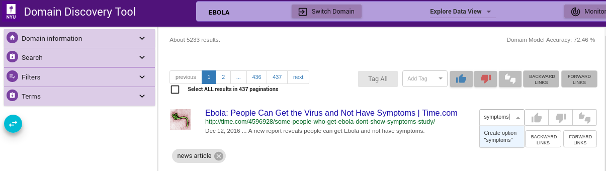

Custom tags can be added using Add Tag text box as shown below. Enter the custom tag in the Add Tag text box and press **enter** key. This adds the tag as a chip below the page info. This can be applied to individual, selected or all pages similar to relevant and irrelevant tags.

