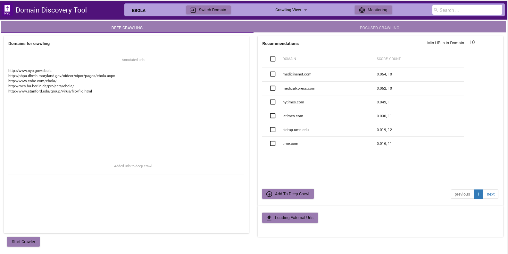

The figure above shows the Deep Crawl View. The list on the left shows all pages annotated as *Deep Crawl* in the Explore Data View. The table on the right shows recommendations of pages that could be added to deep crawl by clicking on the **Add to Deep Crawl**. If keyword terms are added or annotated then recommendations are made based on the score of how many of the keywords they contain. Otherwise the domains are recommended by the number of pages they contain. 

The deep crawler can be started by clicking on **Start Crawler** button at the bottom. This starts a deep crawler with all the pages tagged for Deep Crawl.

You can see the results of the crawled data in **Crawled Data** in the Filters Tab. When the crawler is running it can be monitored by clicking on the **Crawler Monitor** button.
