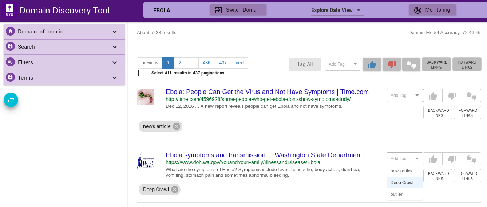

Some tags such as **Deep Crawl** are pre-configured. User can tag a page (or group of pages) for deep crawl by choosing the tag from the Add Tag drop-down as shown. For example, if user wants to deep crawl all the uploaded pages then they can tag the pages **Deep Crawl**.

