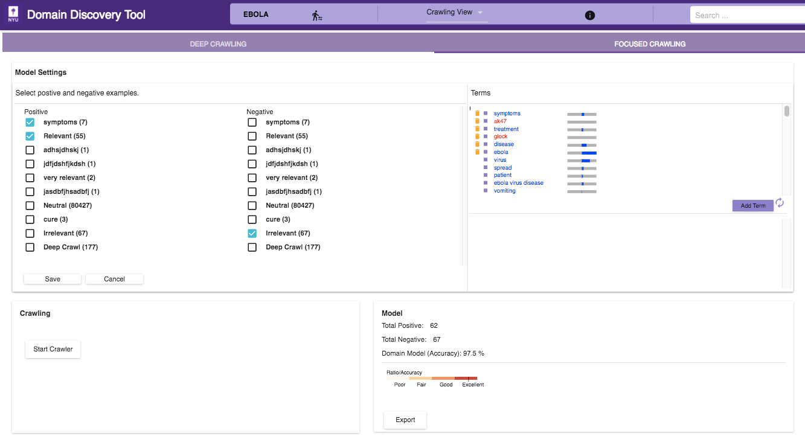

The figure below shows the Focused Crawler View:

1. In the 'Model Settings' on the left select the tags that should be considered as relevant(Positive) and irrelevant(Negative). If there sufficient relevant and irrelevant pages (about 100 each), then you can start the crawler by clicking on the **Start Crawler** button.
2. If there are no irrelevant pages then a page classifier model cannot be built. Instead you can either upload keywords by clicking on the 'Add Terms' in the Terms window. You can also annotate the terms extracted from the positive pages by clicking on them. If no annotated terms are available then the top 50 terms are used to build a regular expression model.
3. Once either a page classifier or a regex model is possible start the focused crawler by clicking on the **Start Crawler**.

You can see the results of the crawled data in "Crawled Data" in the Filters Tab. When the crawler is running it can be monitored by clicking on the 'Crawler Monitor' button.

The Model info on the bottom right shows how good a domain model is if there are both relevant and irrelevant pages annotated. The color bar shows the strength of the model based on the balance of relevant and irrelevant pages and the classifier accuracy of the model.
