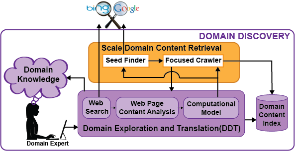

Domain Discovery Tool (DDT) Documentation
=========================================

Domain Discovery is the process of acquiring, understanding and exploring data for a specific domain. Some example domains include human trafficking, illegal sale of weapons and micro-cap fraud. While acquiring knowledge about a domain humans usually start with a conception of that domain. This conception is based on prior knowledge of parts of the domain. The process of gaining a more complete knowledge of the domain involves using this prior knowledge to obtain content that provides additional information about that domain that was previously unknown. This new knowledge of the domain now becomes prior knowledge leading to an iterative process of domain discovery as illustrated in Figure 2. The goals of this iterative domain discovery process are:

* complete the human’s knowledge of the domain
* acquire sufficient content that captures the human coginition of the domain to translate into a computational model

The Domain Discovery Tool (DDT) is an interactive system that helps explore and better understand a domain (or topic) as it is represented on the Web. It achieves this by integrating human insights with machine computation (data mining and machine learning) through visualization. DDT allows a domain expert to visualize and analyze pages returned by a search engine or a crawler, and easily provide feedback about relevance. This feedback, in turn, can be used to address two challenges:

* It assist users in the process of domain understanding and discovery, guiding them to construct effective queries to be issued to a search engine to find additional relevant information; 
* It provides an easy-to-use interface whereby users can quickly provide feedback regarding the relevance of pages which can then be used to create learning classifiers for the domains of interest; and
* It supports the configuration and deployment of focused crawlers that automatically and efficiently search the Web for additional pages on the topic. DDT allows users to quickly select crawling seeds as well as positive and negatives required to create the page classifier required for the focus topic.

Contents
========

.. toctree::
   :maxdepth: 2

   install
   publication
	      
Links
========

* `GitHub repository <https://github.com/ViDA-NYU/domain_discovery_tool_react>`_

Indices and tables
==================

* :ref:`genindex`
* :ref:`modindex`
* :ref:`search`
