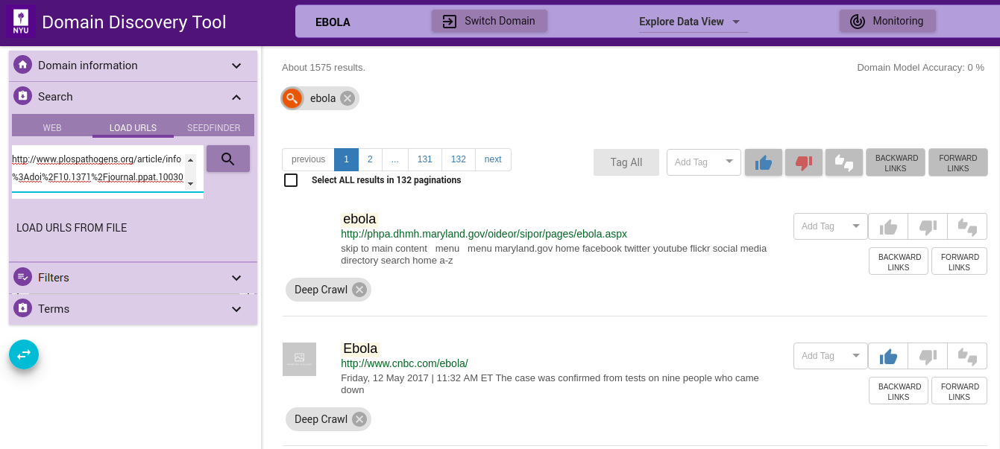
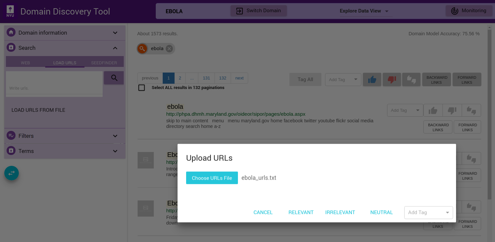
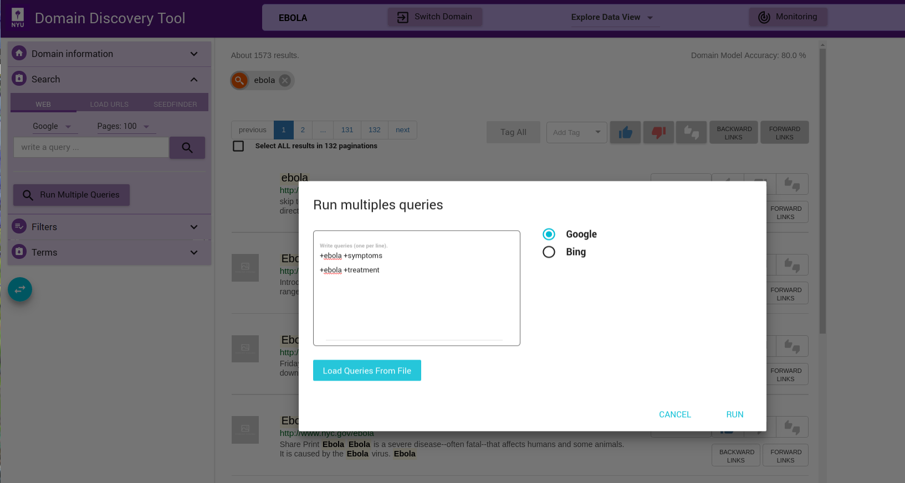

Acquire Data
------------

Continuing with our example of the **Ebola** domain, we show here the 3 methods of uploading data. Expand the Search tab on the left panel. You can add data to the domain in the following ways:

Upload URLs
***********

If you have a set of URLs of sites you already know, you can add them from the **LOAD** tab. You can upload the list of URLs in the text box, one fully qualified URL per line, as shown in figure below:

You can also upload a file with the list of URLs by clicking on the **LOAD URLS FROM FILE** button. This will bring up a file explorer window where you can select the file to upload. *The list of fully qualified URLs should be entered one per line in the file*. For example:

| http://www.plospathogens.org/article/info%3Adoi%2F10.1371%2Fjournal.ppat.1003065
| https://bmcpsychiatry.biomedcentral.com/articles/10.1186/s12888-017-1280-8
| http://www.cdph.ca.gov/programs/cder/Pages/Ebola.aspx

Download an example URLs list file for ebola domain `HERE <https://github.com/ViDA-NYU/domain_discovery_tool/raw/master/docs/ebola_urls.txt>`_. Once the file is selected you can upload them by clicking on **RELEVANT**, **IRRELEVANT**, **NEUTRAL** or **Add Tag** (Add a custom tag). This will annotate the pages correspondingly.

The uploaded URLs are listed in the **Filters** Tab under **Queries** as **Uploaded**.

Web Search
***********

You can do a keywords search on google or bing by clicking on the **WEB** tab. For example, “ebola symptoms”. All queries made are listed in the **Filters** Tab under **Queries**.

.. image:: figures/query_web.png
   :width: 800px
   :align: center
   :height: 400px
   :alt: alternate text

If you have a multiple search queries then you can load them by clicking on the **Run Multiple Queries** button. This will bring up a window where you can either add the queries one per line in a textbox or upload a file that contains the search queries one per line. You can select the search engine to use (**Google** or **Bing**):

Each of the queries will be issued on Google or Bing (as chosen) and the results made available for exploration and annotation in the **Filters** Tab under **Queries** as **Uploaded**.

	 
      

