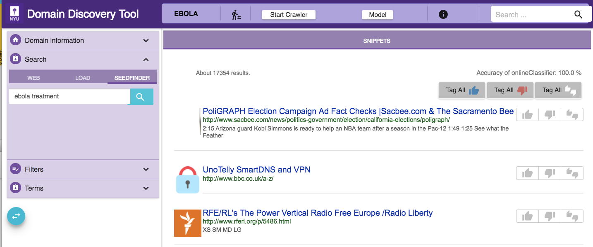

Load Data
---------

Expand the Search tab on the left panel. You can add data to the domain in the following ways:

Web Search
~~~~~~~~~~

.. image:: query_web.png
   :width: 800px
   :align: center
   :height: 400px
   :alt: alternate text

You can do a keywords search on google or bing by clicking on the **WEB** tab. For example, “ebola symptoms”. 

Upload URLs
~~~~~~~~~~~

Go to the **LOAD** tab. You can upload a list of urls in the text box as shown in figure below:

.. image:: load_url_text.png
   :width: 800px
   :align: center
   :height: 400px
   :alt: alternate text

Enter one URL per line.

You can also upload a file with a list of urls by clicking on the **LOAD URLS FROM FILE** button. This will bring up a file explorer window where you can select the file to upload. The list of URLs should be entered one per line in the file. Download an example URLs list file for ebola domain `HERE <https://github.com/ViDA-NYU/domain_discovery_tool_react/raw/master/docs/ebola_urls.txt>`_. 

SeedFinder
~~~~~~~~~~

Instead of making multiple queries to Google/Bing yourself you can trigger automated keyword search on Google/Bing and collect more web pages for the domain using the SeedFinder. This requires a domain model. So once you have annoated sufficient pages, indicated by a non-zero accuracy on the top right corner, you can use the SeedFinder functionality.

To start a SeedFinder search click on the SEEDFINDER tab. 

Enter the initial search query keywords, for example **ebola treatment**, as shown in the figure above. The SeedFinder issues this query to Google/Bing. It applies the domain model to the pages returned by Google/Bing. From the pages labeled relevant by the domain model the SeedFinder extracts keywords to form new queries which it again issues to Google/Bing. This iterative process terminates when no more relevant pages are retrieved or the max number of queries configured is exceeded. The results of the SeedFinder queries can be found under Filtering->Queries. These pages can now be analysed and annotated just like the other web pages.
