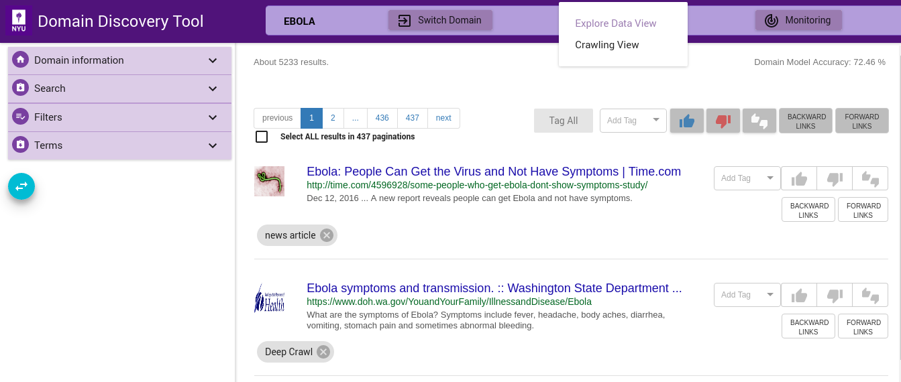

Run Crawler
-----------

Once a sufficiently good model is available or pages are tagged for a deep crawl you can change from **Explore Data View** to the **Crawler View** to start the crawlsshown below:

Step 4a
*******

.. include:: deep_crawl.rst

Step 4b
*******

.. include:: focused_crawl.rst
