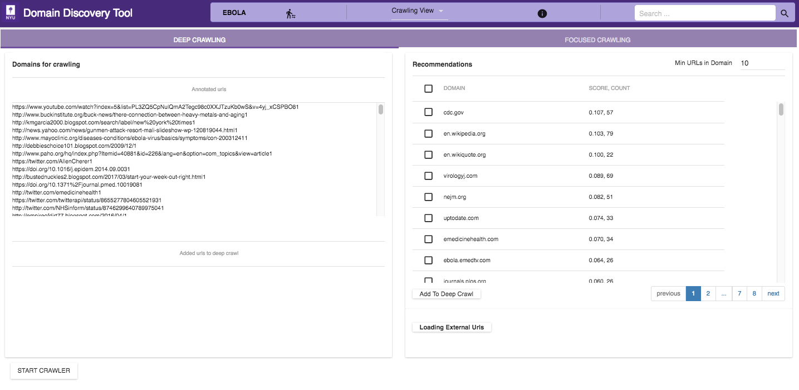

Run Crawler
-----------

Once a sufficiently good model is available or pages are uploaded for a deep crawl you can change from Explore Data View to the Crawler View shown below:

The crawler view support a deep and focused crawl. The figure above shows the Deep Crawl View. The list on the left shows all pages annoated as Deep Crawl in the Explore Data View. The table on the right shows recommendations of pages that could be added to deep crawl by clicking on the 'Add to Deep Crawl'. If keyword terms are added or annotated then recommendations are made based on the score of how many of the keywords they have. Otherwise the domains are reocommended by the number of pages they contain. 

The ACHE deep crawler can be started by clicking on "Start Crawler" button at the bottom. This starts a deep crawler with all the pages tagged for Deep Crawl.

You can see the results of the crawled data in "Crawled Data" in the Filters Tab. When the crawler is running it can be monitored by clicking on the 'Crawler Monitor' button.

The figure below shows the Focused Crawler View:

.. image:: focused_crawl.png
   :width: 800px
   :align: center
   :height: 400px
   :alt: alternate text

First, in the 'Model Settings' on the left select the tags that should be considered as relevant(Positive) and irrelevant(Negative). If there sufficient relevant and irrelevant pages (about 100 each), then you can start the crawler by clicking on the Start Crawler button. If there are irrelevant pages then a page classifier model cannot be built. Instead you can either upload keywords by clicking on the 'Add Terms' in the Terms window. You can also annotate the terms extracted from the positive pages by clicking on them. If not annotated terms are available then the top 50 terms are used to build a regular expression model.

Once either a page classifier or a regex model is possible start the focused crawler by clicking on the Start Crawler.

You can see the results of the crawled data in "Crawled Data" in the Filters Tab. When the crawler is running it can be monitored by clicking on the 'Crawler Monitor' button.
