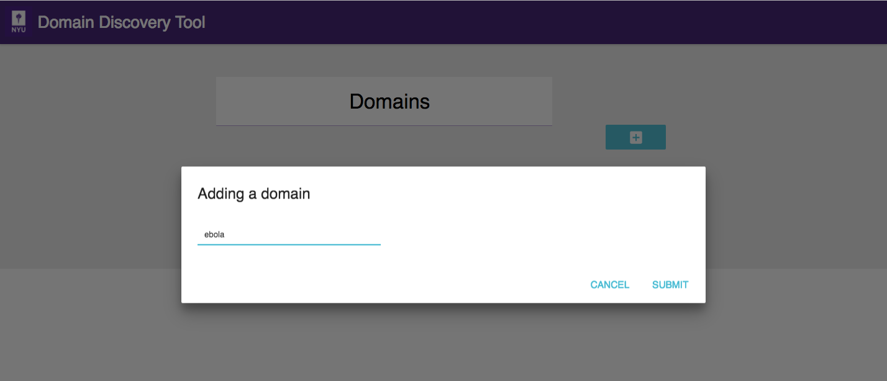
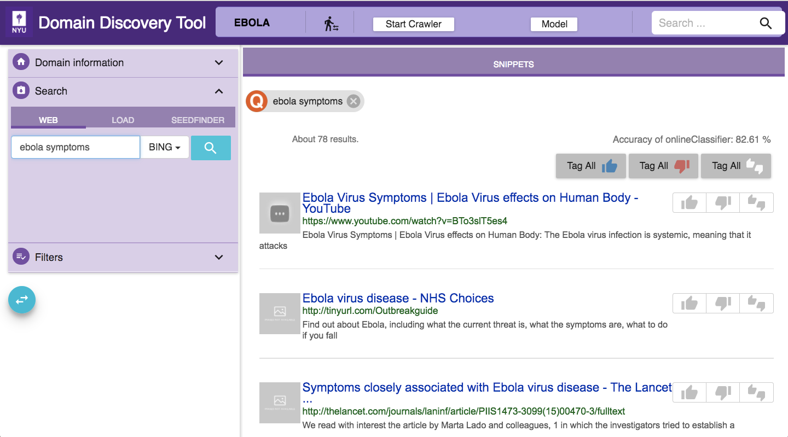

Use Domain Discovery Tool
=========================

Now you should be able to head to http://localhost:8084/ to interact with the tool.

Add Domain
----------

Domain maintains context of domain discovery. 

Once domain is added click on it to collect and annotate data.

Domain Discovery
----------------

Data Loading
~~~~~~~~~~~~

WEB: Keyword search on google or bing. For example, “ebola symptoms”   
LOAD: Upload a list of urls in the text box or upload a file with a list of urls
SEEDFINDER: Triggers automated keyword search on google and bing and collect seed urls. This requires a domain model.

Filtering
~~~~~~~~~

QUERIES: Filter by keyword web searches 
TAGS: Filter by annotation tags
MODEL: Filter by predicted model tags
SEARCH: Search by keywords within the downloaded text

Annotation
~~~~~~~~~~

Currently pages can be annotated as Relevant, Irrelevant or Neutral. Annotations are used to build a domain model.

Domain Model
~~~~~~~~~~~~

The accuracy of the domain model is displayed on the top right corner. It provides an indication of the model coverage of the domain and how it is influenced by annotations.

