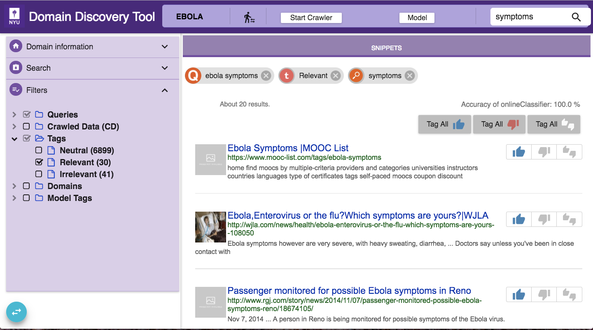

Use Domain Discovery Tool
=========================

Now you should be able to head to http://localhost:8084/ to interact with the tool.

Add Domain
----------

Begin by adding a domain. Domain maintains context of domain discovery. 

.. image:: add_domain.png
   :width: 800px
   :align: center
   :height: 400px
   :alt: alternate text

Once domain is added click on it to collect and annotate data.

Domain Discovery
----------------

Data Loading
~~~~~~~~~~~~

.. image:: query_web.png
   :width: 800px
   :align: center
   :height: 400px
   :alt: alternate text

Expand the Search tab on the left panel. You can add data to the domain in the following ways:

WEB: Keyword search on google or bing. For example, “ebola symptoms”

LOAD: Upload a list of urls in the text box or upload a file with a list of urls

SEEDFINDER: Triggers automated keyword search on google and bing and collects seed urls. This requires a domain model.

Filtering
~~~~~~~~~

Once some pages are loaded into the domain it can be analysed with various filters available in the Filters tab on the left panel such as:

QUERIES: Filter by keyword web searches 

CRAWLED DATA: Filter the relevant and irrelevant crawled data

TAGS: Filter by annotation tags

DOMAINS: Filter by top level domains of all the pages in the domain

MODEL TAGS: Filter by predicted model tags

SEARCH: Search by keywords within the downloaded text

Annotation
~~~~~~~~~~

Currently pages can be annotated as Relevant, Irrelevant or Neutral. Annotations are used to build a domain model.

Domain Model
~~~~~~~~~~~~

The accuracy of the domain model is displayed on the top right corner. It provides an indication of the model coverage of the domain and how it is influenced by annotations.

Run Crawler
~~~~~~~~~~~

Once a sufficiently good model is available you can start the ACHE crawler by clicking on "Start Crawler" button. You can see the results of the crawled data in "Crawled Data" in the Filters Tab. When the crawler is running it can be monitored at http://localhost:8080/.

