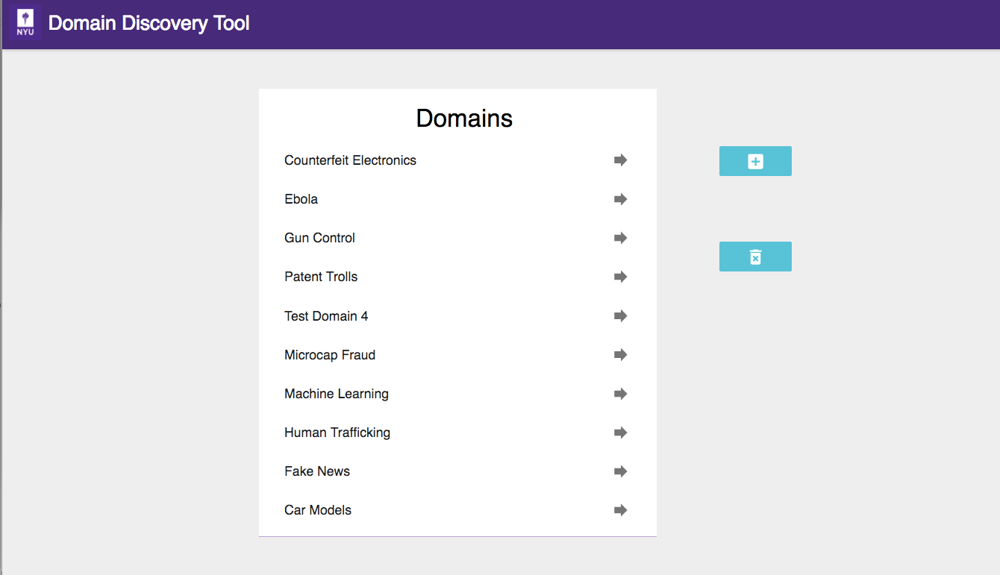

Use Domain Discovery Tool
=========================

Now you should be able to head to http://localhost:8084/ to interact with the tool.

Add Domain
----------

Begin by adding a domain on the Domains page (initial page), shown in the figure above, by clicking on the |add_domain| button. Domain maintains context of domain discovery.

.. |add_domain| image:: add_domain_button.png

.. image:: add_domain.png
   :width: 800px
   :align: center
   :height: 400px
   :alt: alternate text

On the **Adding a domain** dialog shown in figure above, enter the name of the domain you would like to create, for example **Microcap Fraud**, and click on **Submit** button. You should now see the new domain you added in the list of domains.

Once domain is added click on domain name in the list of domains to collect, analyse and annotate web pages.

Domains can be deleted by clicking on the |delete_domain| button.

.. image:: delete_domain.png
   :width: 800px
   :align: center
   :height: 400px
   :alt: alternate text

On the **Deleting a domain** dialog select the domains to be deleted in the list of current domains and click on **Submit** button. They will no longer appear on the domains list.

**NOTE: This will delete all the data collected for that domain.**
			   
Data Loading
------------

.. image:: query_web.png
   :width: 800px
   :align: center
   :height: 400px
   :alt: alternate text

Expand the Search tab on the left panel. You can add data to the domain in the following ways:

WEB: Keyword search on google or bing. For example, “ebola symptoms”

LOAD: Upload a list of urls in the text box or upload a file with a list of urls. The list of URLs should be entered one per line both in the text input and in the file.

SEEDFINDER: Triggers automated keyword search on Google/Bing and collects seed urls. This requires a domain model.

Filtering
---------

.. image:: filters.png
   :width: 800px
   :align: center
   :height: 400px
   :alt: alternate text

Once some pages are loaded into the domain, they can be analyzed with various filters available in the Filters tab on the left panel such as:

QUERIES: Filter by keyword web searches 

CRAWLED DATA: Filter the relevant and irrelevant crawled data

TAGS: Filter by annotation tags

DOMAINS: Filter by the top level domains of all the pages in the domain

MODEL TAGS: Filter by predicted model tags

SEARCH: Search by keywords within the downloaded text. NOTE: This search is available on the top right corner.

Annotation
----------

Currently, pages can be annotated as Relevant, Irrelevant or Neutral. Annotations are used to build a domain model.

Domain Model
------------

DDT incrementally builds a model as the user annotates the retrieved pages. The accuracy of the domain model is displayed on the top right corner. It provides an indication of the model coverage of the domain and how it is influenced by annotations.

Run Crawler
-----------

Once a sufficiently good model is available you can start the ACHE crawler by clicking on "Start Crawler" button. You can see the results of the crawled data in "Crawled Data" in the Filters Tab. When the crawler is running it can be monitored at http://localhost:8080/.

