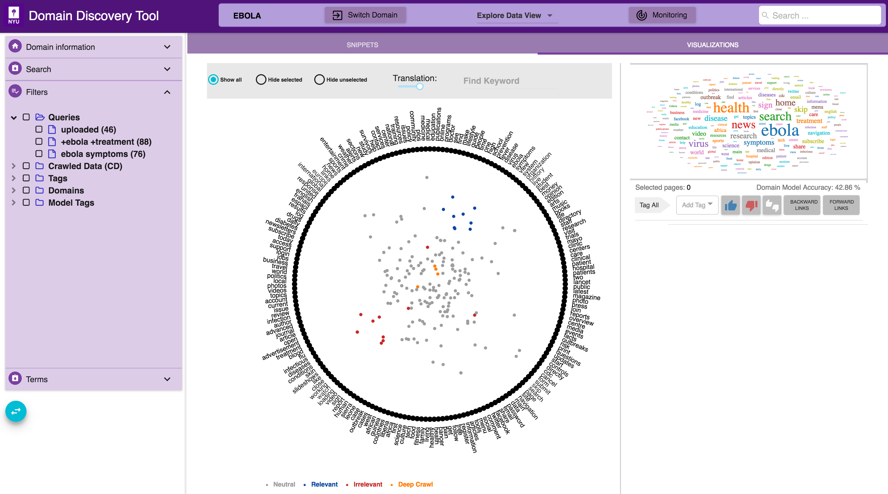
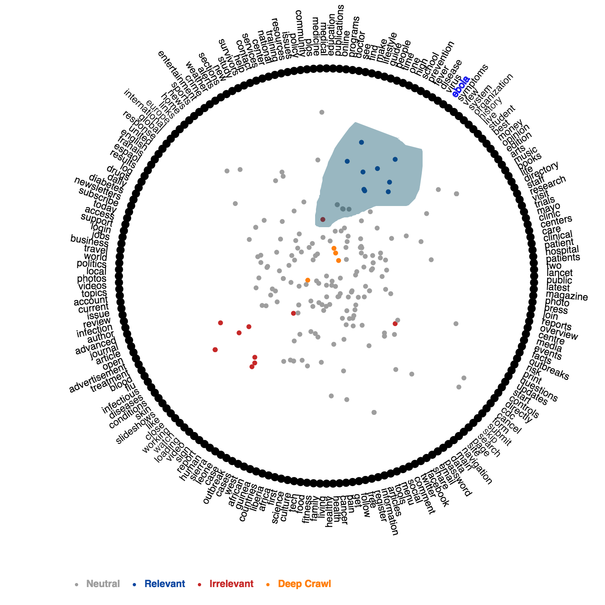
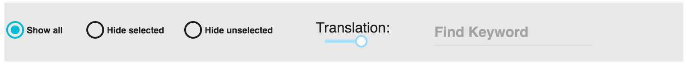
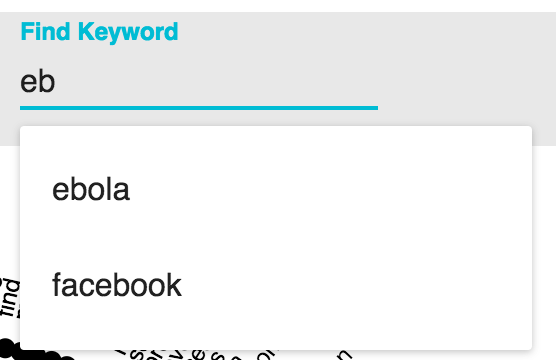
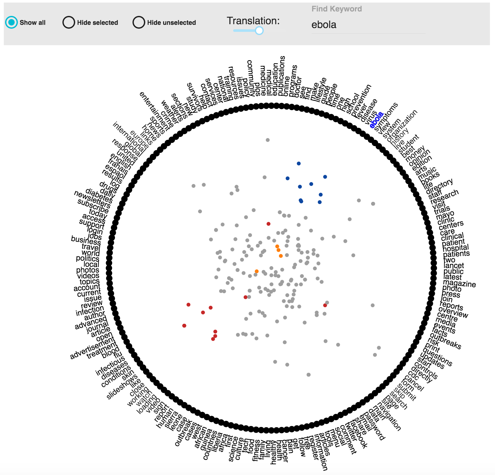

Visualization through RadViz
----------------------------

Select the **Visualization Tab** in the **Explore Data View** to see the multidimensional scaling visualization using RadViz.

RadViz is a data visualization that enables users to explore and analyze samples in a data set (such as a corpus of web pages in the case of DDT), represented as points in the visualization, in terms of similarity relations among semantic descriptors (keywords on the pages). Keywords are located along a circle, and pages are represented as a points in the circle. The more similar the pages the closer the distance between them. Also, the greater the proximity of a page to a keyword, the greater the frequency of occurrence of that keyword in that page. This kind of analysis allows users to identify regions of interest in the data set according to the most relevant features of the sample.

Explore Pages
*************

In order to explore the pages in the visualization you would need to select the pages that you want to see the various details for.

Selection of a group of pages is done using lasso selection. For this, the user simply drags a freehand selection around the pages located in the circle in RadViz, similar to how you would outline something on a piece of paper with a pen or pencil. To start the lasso selection users simply have to click at the spot where you want to begin the selection, then continue holding your mouse button down and drag to draw a freeform selection outline. To complete the selection, simply release your mouse button. You don't necessarily have to return the same spot you started from, but if you don't, RadViz will automatically close the selection for you by drawing a straight line from the point where you released your mouse button to the point where you began, so in most cases, you will want to finish where you started.

When the pages are selected, you will observe the following:

- Keywords contained in the selected pages will be highlighted along the circle.
- A WordCloud of all the top keywords contained in the selected pages is generated in the right top corner. The font size of the keyword in the word cloud is proportional to the frequency of occurence of the word
- Snippets of selected pages are shown at the right bottom corner

Pages can be tagged through RadViz as ’Positive’ and ’Negative’, and even Custom Tag, by drawing lasso around any region of interest, which made the selection of a sub-group of pages very easy, and then users can tag the selected pages as ’Positive’, ’Negative’ and Custom Tag.

ToolBar RadViz
**************

This visualization has five controls to interact with, whose functionlity are described below.

Showing data in RadViz
<<<<<<<<<<<<<<<<<<<<<<

.. |toolbar_select| image:: figures/visualization_toolbar_select.png

|toolbar_select| radio buttons, can be used to show or hide data on RadViz.

**Show all:** Show all is selected by default in this visualization. It shows all the pages present in the data collection.

**Hide selected:** This option hides the selected pages of the current view.

**Hide unselected:** This option hides the pages that are not selected.

Translation in RadViz
<<<<<<<<<<<<<<<<<<<<<<

.. |toolbar_translation| image:: figures/visualization_toolbar_transaltion.png

|toolbar_translation|  slider allows to calibrate the degree of denseness or sparseness of the representations of the pages in the visualization.

Find Keyword in RadViz
<<<<<<<<<<<<<<<<<<<<<<

|toolbar_find_keyword| auto-complete text-field allows to search a keyword over all keywords in the visualization. Blue font color is used to highlight the keyword (shown below). This functionality is supported by an autocomplete process using all keyword used in th current view of RadViz.

