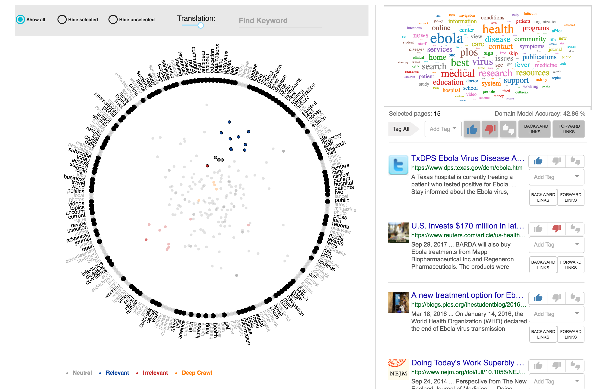

.. image:: figures/visualization_toolbar_lassoSelect.png
   :width: 400px
   :align: center
   :height: 410px
   :alt: alternate text

To create the lasso the user simply drags a freehand selection around the pages located into the circle in RadViz, in a similar way to how you would outline something on a piece of paper with a pen or pencil. To start the lasso users simply have to click at the spot where you want to begin the selection, then continue holding your mouse button down and drag to draw a freeform selection outline. To complete the selection, simply return to the spot where you began and release your mouse button. You don't necessarily have to return the same spot you started from, but if you don't, RadViz will automatically close the selection for you by drawing a straight line from the point where you released your mouse button to the point where you began, so in most cases, you will want to finish where you started.

After complete the selection, RadViz will highlight all the keywords along the circle that are relevant on selected pages. Bold font is used to highlight. Also, the WordCloud, located in the right top corner is updated using just the selected pages. The most frequently keyword are showed with bigger font size. Furthermore, on the right bottom corner, the snippets of selected pages are showed.

