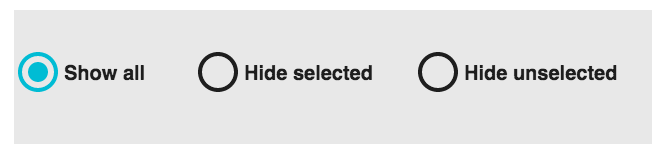

|toolbar_select| radio buttons, can be used to show or hide data on RadViz.

**Show all:** Show all is selected by default in this visualization. It shows all the keywords present in the data collection.
**Hide selected:** This option hides the selected pages of the current view.
**Hide unselected:** This option acts in a contrary way of the previous option. It hides the pages that are not selected.
